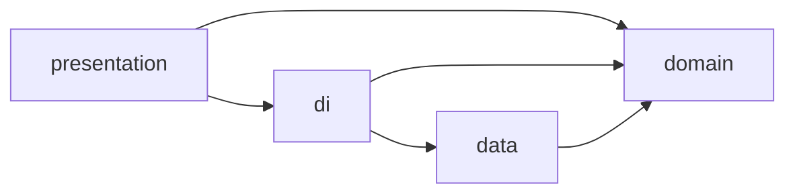

# Android Clean Architecture Template

This project means to be base for realization of clean architecture (CA) project with mvvm and di

Repository provides structure of directories and generic implementations of classes that are characteristic for CA

## Get started

>**Notice!** Template does not has work ready logic and all classes are used _only_ to show files and dependencies structure

To use this template clone project to your android studio and than change git origin remote link:
```
$ git remote rm origin
$ git remote add origin https://gitlab.com/devcraft/myExcitingProject.git
$ git config master.remote origin
$ git config master.merge refs/heads/master
```
But project is not ready yet! 
To run your first build you have to:
1. change app package name in build.gradle(:presentation);  
2. change app name in strings.xml(:presentation);
3. create debug and release keystores in ../keystore directory;
4. specify path, key alias, and passwords for each of keystores in gradle.properties file;
5. remove gradle dependencies and their uses that useless for your project. 

In gradle.properties you will also see other environment variables:
```
env.HOST_URL=https://host.url/  
env.DATABASE_NAME=database_name.db
```
if your app communicates with server then specify server base url in env.HOST_URL<br/>
if your app means to used with database, then specify unique database name in env.DATABASE_NAME
Otherwise remove variables and its uses.

Now you have project **base** that can be run and you can continue writing your masterpiece.

##  How app structure is build?

App has 4 modules:

* presentation (app)
* data
* domain
* di

modules are connected into dependencies graph, where:
  * data depends on domain
   ```mermaid
graph LR
D[data] --> B[domain]
```
  * presentation depends in domain and di
 ```mermaid
graph LR
A[presentation] --> B[domain]
A --> C[di]
```
  * di depends on data and domain
   ```mermaid
graph LR
C[di] --> B[domain]
C --> D[data]
```
As a result we have this graph:


Presentation interacts with domain using interactor classes that implement use cases.<br/> 
Use cases logic is represented by implementation of domain repository interfaces on data layer.<br/>
Repositories it self interact with data sources that available only on data module  and any other module does not now that they exist.<br/> 

>**Notice!** DI module is used for dependencies injection (datasource to repository, repository to interactor, interactor to viewModel and etc). But for in module injection should be created **di package** with its own koin modules.   

So as a result presentation module "knows" **only**  about domain throw di module.

Each module has its own bunch of data entities that map from one to another using MapExtensions.kt in data and presentation modules.

Entities have suffix that changes depending on model or data source:
 * domain module data entities have "-Model" suffix
 * data module data entities has 2 types of suffix "-Net" for network and "-Entity" for database
 * presentation module data entities do not have suffix at all.             
 
[common mistakes in understanding of clean architecture](https://habr.com/ru/company/mobileup/blog/335382/)

